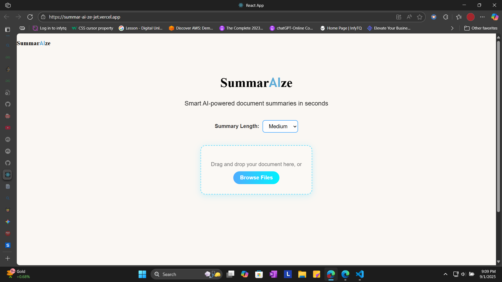
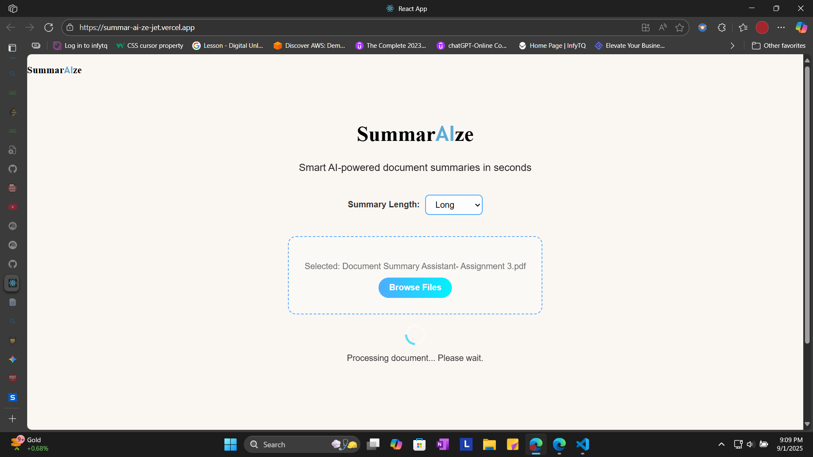
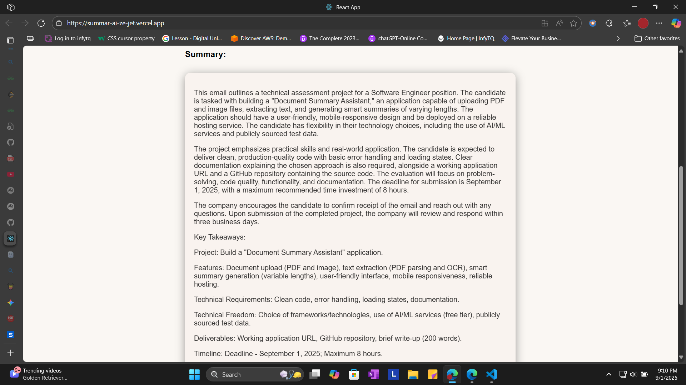

**SummarAIze**

## 📝 Description

**SummarAIze** is a full-stack web application that simplifies document analysis by generating smart, AI-powered summaries from any uploaded PDF or image. The application provides an intuitive drag-and-drop interface, making it easy for users to quickly get the essential information and key points from their documents. It is a powerful tool for students, researchers, and professionals who need to digest large amounts of information efficiently.

This project was built as a technical assessment to demonstrate proficiency in building a practical, real-world application with a modern MERN stack and a Python microservice.

## 🧰 Features

* **Document Upload:** Seamlessly upload PDF files and image files via a drag-and-drop or file picker interface.
* **Intelligent Summarization:** Automatically generate summaries of varying lengths (short, medium, long) using a powerful AI model.
* **OCR Integration:** Extracts text from image files (scanned documents) using **Optical Character Recognition (OCR)** technology.
* **Responsive Design:** The user interface is designed to be mobile-responsive for use on different devices.
* **Efficient Backend:** Utilizes a Node.js backend with a Python child process for robust text extraction and AI API communication.

## 🚀 Live Demo

### Ingestion: Document Upload


This shows the initial state of the application, ready for a user to upload a document via the drag-and-drop zone or file picker.

### Processing: The Loading State


Once a file is uploaded and the "Get Summary" button is clicked, a loading state appears to provide visual feedback to the user while the backend is processing the document and generating the summary.

### Transformation: The Final Summary


This shows the final output, a structured and formatted summary from the AI, highlighting the key points of the uploaded document.

**Live Site:** [https://summar-ai-ze-jet.vercel.app/](https://summar-ai-ze-jet.vercel.app/)

## 🛠️ Installation & Setup

Follow these steps to set up and run the project on your local machine.

### Prerequisites
* Node.js (LTS version)
* Python 3.x
* npm
* Tesseract OCR engine (must be installed and in your system's PATH)

### Steps

```bash
# Clone the repository
git clone https://github.com/your-username/your-repo-name.git
cd your-repo-name

# Install frontend dependencies
npm install --prefix frontend

# Install backend dependencies
npm install --prefix backend

# Start the frontend
npm start --prefix frontend

# Start the backend in a separate terminal
npm start --prefix backend
```

### Environment Variables

Create a `.env` file in the `/backend` directory with the following variable:

```bash
GEMINI_API_KEY=your_gemini_api_key_here
```
### Project Structure
<pre><code>
/document-summary-assistant
├── /frontend
│   ├── ...
│   └── src/
│
├── /backend
│   ├── server.js
│   ├── process_document.py
│   └── ...
│
└── .gitignore
└── package.json (root)
</code></pre>

### API Endpoints
The backend exposes a single API endpoint for document processing.

**POST /upload-document**

*Accepts a multipart/form-data request with a document file and a summaryLength parameter.

*Success Response: Returns a JSON object with the generated summary.
```bash
{
  "message": "Summary generated successfully!",
  "summary": "Here is your summarized content..."
}
```
### Testing Instructions
You can test the API endpoint using a tool like Postman.

*Endpoint: `https://summaraize-fksu.onrender.com/upload-document`

*Method: `POST`

*Body: `form-data`

`document`: File (select your PDF or image)

`summaryLength`: Text (select short, medium, or long)

### Acknowledgments
**Gemini API**: For powering the intelligent summarization.

**Express.js, React**: For the backend and frontend frameworks.

**PyMuPDF, Tesseract OCR**: For robust document parsing and text extraction.

**Render, Vercel**: For providing a seamless deployment platform
